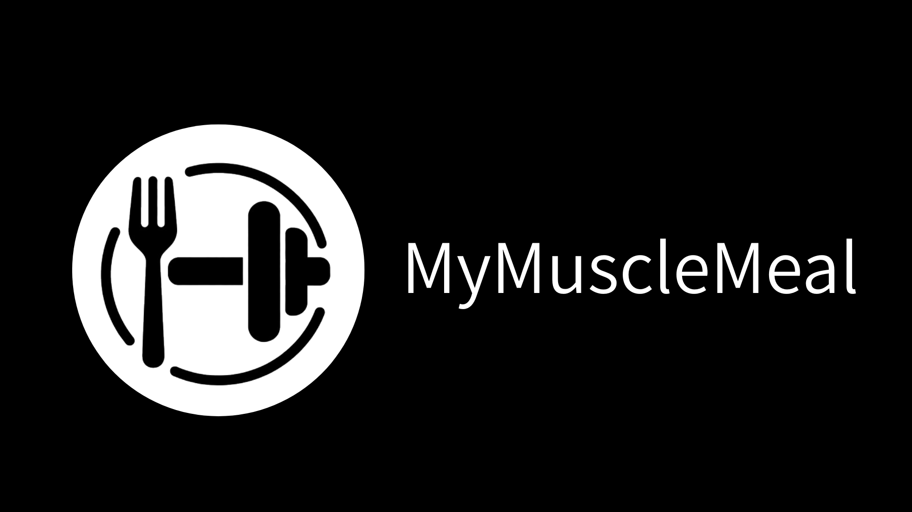
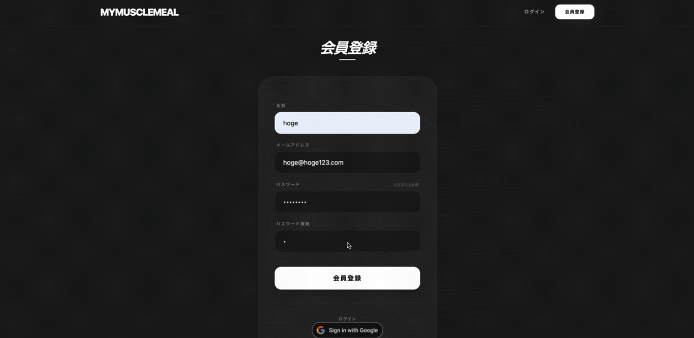
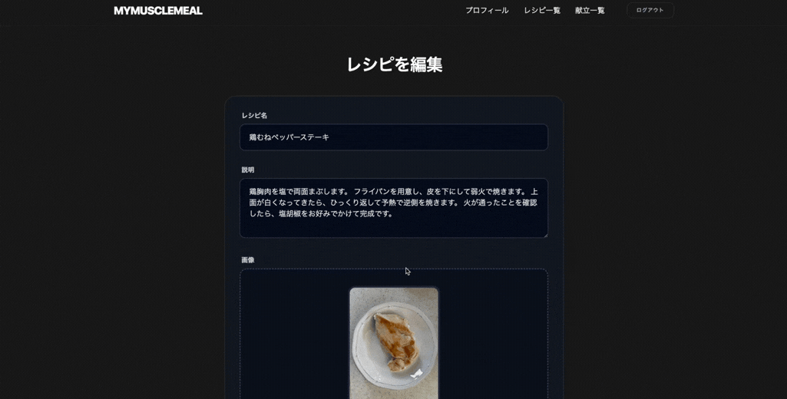

## アプリ名：『MyMuscleMeal』

## サービス概要
筋トレ・ダイエット中の方向けの献立管理アプリです。
PFC（タンパク質・脂質・炭水化物）バランスを自動計算し、献立作成の手間を削減します。
ユーザー同士で筋トレ飯を共有することで、レシピのアイデア交換とモチベーション向上を図ります。

## サービスURL
https://my-muscle-meal.com

## このサービスへの思い・作りたい理由

私は以前、ダイエットのために筋トレをしていた時期がありました。その際、食事をどうするかということに非常に悩んでおりました。ただ食べる量を減らせば良いとい単純な話ではないし、タンパク質、脂質、炭水化物のバランス（PFCバランス）を考え計算して献立を作るのはめんどくさい、そもそも美味しい筋トレ飯を思いつかない、といった悩みを抱えていました。筋トレしている知り合いに食事について聞いても、なんとなくプロテインは飲んでいるが食事は適当にしているといった話を多く聞きます。  そのような悩みがある中、PFCを自動的に計算し手間を省いたり、周りの人と筋トレ飯を共有することでアイデアを得たりすることで、筋トレやダイエットにおいて、料理や食事管理のハードルが下がるのではと考えました。

## ユーザー層について

- ダイエットや筋トレをしているが食事に関して悩んでいる人
- 筋トレ初心者（食事管理の知識が少ない）
- ダイエット中で栄養バランスを意識したい人
- 料理のレパートリーを増やしたい筋トレ愛好者

## サービスの利用イメージ

- 一週間の献立の計画を立てる
- 事前に設定してあるPFCの数値をもとに、一週間や一日単位のPFCの合計値を計算する
- 自分の筋トレ飯を他のユーザーに共有できる
- 他のユーザーの料理を見ることができ、それを計画に組み込むことができる

## ユーザーの獲得について
SNSによる宣伝
- Twitter/Instagram での筋トレ・ダイエットハッシュタグでの投稿

## サービスの差別化ポイント・推しポイント
**筋トレ・ダイエット特化型の料理共有プラットフォーム**  
既存の料理共有アプリ（クックパッド等）や栄養管理アプリ（MyFitnessPal等）は存在しますが、
筋トレ・ダイエットに特化したコミュニティ型アプリは少ないのが現状です。

**等身大の一般人による筋トレ飯シェア機能**
- プロの料理や専門家のレシピではなく、一般ユーザーのリアルな筋トレ飯を共有
- 簡単に作れる料理（調理時間や難易度を表示）
- コスパの良いレシピ（材料費の目安を表示）

**筋トレ・ダイエット向けの特化機能**
- 事前に登録された情報をもとにPFC計算を自動化し、誰でも簡単に栄養バランスを管理
- 筋トレ飯スコア機能：理想のPFCバランス（ローファットダイエットやローカーボダイエットのPFCバランス）からどれだけ近いかスコアで評価
- 増量期・減量期などの料理に対するタグ付け

## 機能紹介
| ユーザー登録 / ログイン |
| :---: | 
|  |
| 
『名前』『メールアドレス』『パスワード』『確認用パスワード』を入力してユーザー登録を行います。ユーザー登録後は、自動的にログイン処理が行われるようになっており、そのまま直ぐにサービスを利用する事が出来ます。 |

| 料理登録（名前、材料、PFC値） |
| :---: | 
|  |
| 
ユーザーがオリジナルのレシピを投稿・管理できる機能です。料理名や説明に加えて、画像やPFC値も登録できます。 |

| 献立登録（名前、料理、PFC値） |
| :---: | 
|  |
| 
複数のレシピを組み合わせて、1日の食事プラン（献立）を作成・管理できる機能です。筋トレや健康管理において重要な PFCバランス（タンパク質・脂質・炭水化物） を意識した食事設計をサポートします。 |
- PFC自動計算
- 料理閲覧

追加予定
- 週間献立
- ランキング
- 筋トレ飯スコア機能

## 設計書
### 画面遷移図
[Figmaで確認](https://www.figma.com/design/IYlyHvYIT0zrIoKEwhPASt/%E7%84%A1%E9%A1%8C?node-id=0-1&p=f&t=fdUP2lEoapcUDGs1-0)

### ER図
[dbdiagramで確認](https://dbdiagram.io/d/68ef69772e68d21b418d8d4f)

## 使用する技術スタック
- 使用するフレームワーク：Ruby on Rails
- ログイン機能 :devise
- 検索機能 :ransack
- ページネーション :kaminari
- データベース：PostgreSQL
- デプロイ先：Render
- 画像アップロード：Active Storage + Cloudinary
- CSS フレームワーク：Tailwind CSS